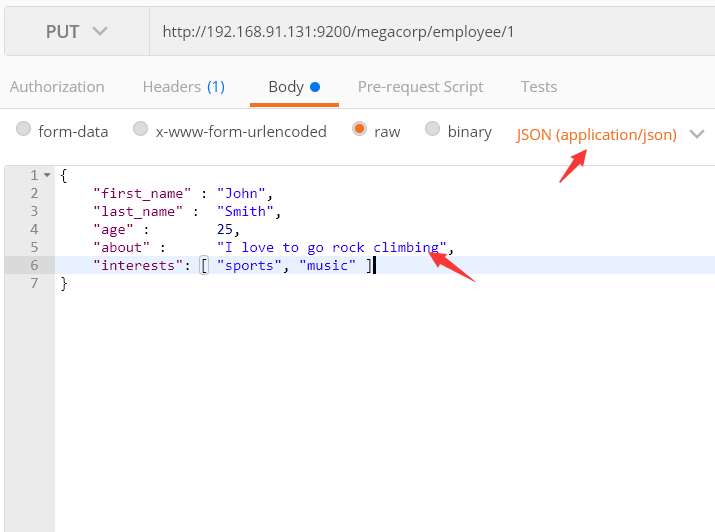
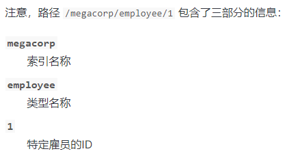
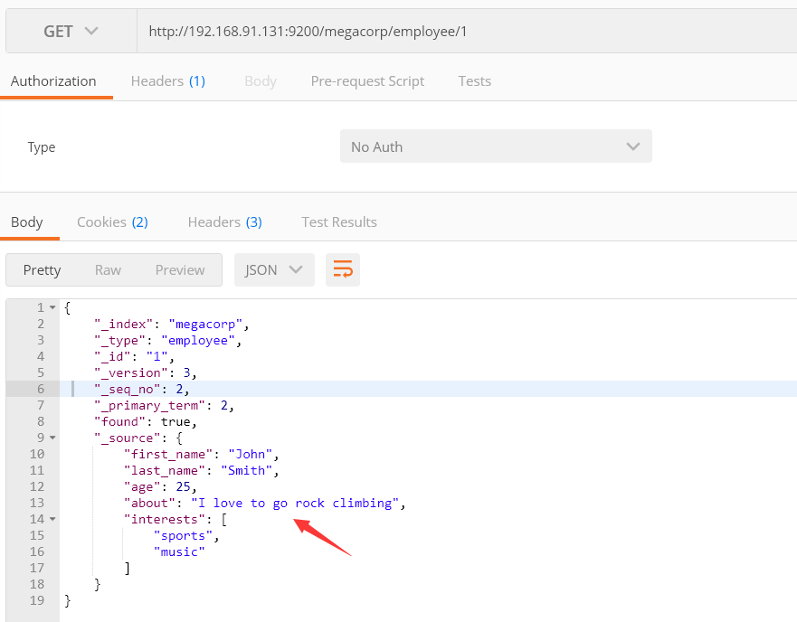
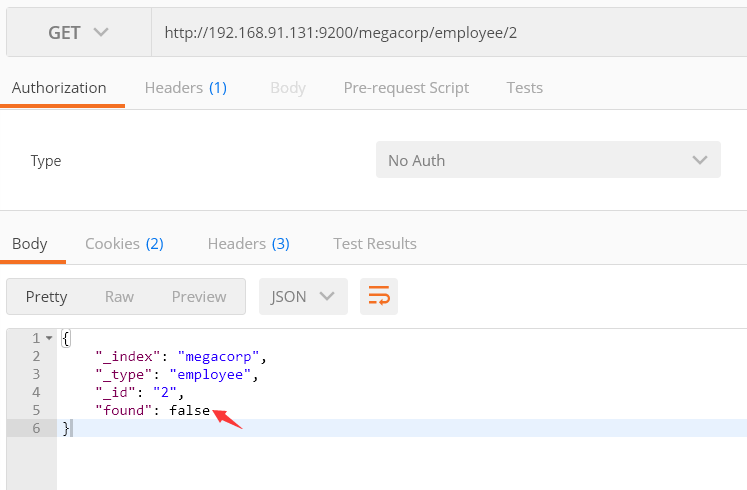
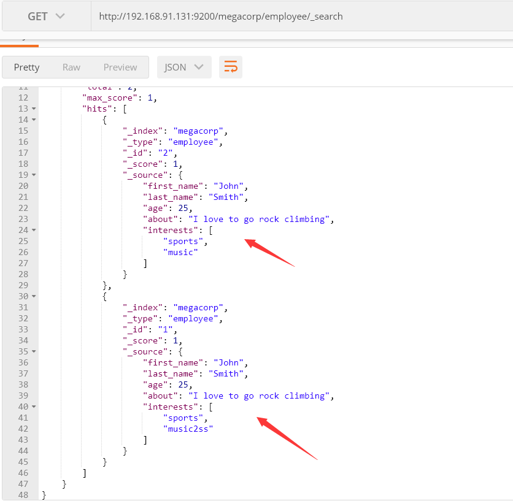
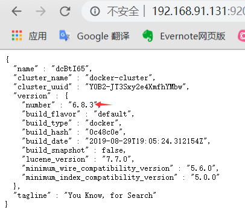
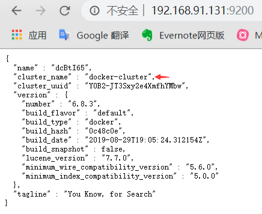

# elasticsearch上手

> ElasticSearch遵循restful风格;该文章只是elasticsearch入门不做详细阐述,详细信息请查看官方文档

## docker安装ElasticeSearch

```text
## pull ElasticSearch
docker pull elasticsearch
## create network
docker network create somenetwork
## docker run
docker run -d --name elasticsearch --net somenetwork -p 9200:9200 -p 9300:9300 -e "discovery.type=single-node" elasticsearch:tag
```

## ElasticSearch测试

> 示例参考权威指南中文版:索引员工文档\(此处使用postman来进行测试\)。 DELEATE,HEAD请求有兴趣的朋友可以试下,这儿就不试一了


### PUT请求

## 



### GET请求

数据存入后,我们再通过get请求来试着进行下查询

* 数据存在



* 数据不存在

  

## 查询所有员工信息

```text
GET /megacorp/employee/_search
```



## 搜索姓名为smith的员工

```text
## 使用轻量搜索进行查询
GET /megacorp/employee/_search?q=last_name:Smith
## 查询表达式进行查询
{
    "query" : {
        "match" : {
            "last_name" : "Smith"
        }
    }
}
```

## Spring Boot整合ElasticSearch

SpringBoot支持两种技术来实现与ES交互\(1:Jest 2.SpringData ElasticSearch\)

### Jest简单上手

从JestAutoConfiguration可以得知,如果使用Jest需要导入对应的包,版本需要和version保持一致 

```markup
<dependency>
        <groupId>io.searchbox</groupId>
        <artifactId>jest</artifactId>
        <version>6.3.1</version>
 </dependency>
```

```java
@ConfigurationProperties(prefix = "spring.elasticsearch.jest")
public class JestProperties {

    /**
     * Comma-separated list of the Elasticsearch instances to use.
     * 默认:http://localhost:9200
     */
    private List<String> uris = new ArrayList<>(Collections.singletonList("http://localhost:9200"));

    /**
     * Login username.
     */
    private String username;

    /**
     * Login password.
     */
    private String password;

    ...
}
```

1. 配置yml

   ```yaml
   spring:
   elasticsearch:
    jest:
      uris: http://192.168.91.131:9200
   ```

2. 创建article bean

   ```java
   public class Article {
    @JestId
    private Integer id;
    private String author;
    private String title;
    private String content;
    ...
   }
   ```

3. 测试类

   \`\`\`

   @Autowired

   JestClient jestClient;

@Test public void contextLoads\(\) throws IOException { //1.给Es索引\(保存\)一个文档 Article article = new Article\(\); article.setId\(1\); article.setAuthor\("john"\); article.setTitle\("震惊!..."\); article.setContent\("page"\);

```text
 //索引.类型.编号(类似:/megacorp/employee/1示例,此处已经在bean里面指定了id)
 Index index = new Index.Builder(article).index("lsj").type("article").build();
 jestClient.execute(index);
```

}

```text
4. 发送请求进行测试


5. 测试搜索
```java
/**
 * 测试搜索
 */
@Test
public void search() throws IOException {
        String json = "{\n" +
                "    \"query\" : {\n" +
                "        \"match\" : {\n" +
                "            \"author\" : \"john\"\n" +
                "        }\n" +
                "    }\n" +
                "}";
        Search search = new Search.Builder(json).addIndex("lsj").addType("article").build();
        SearchResult result = jestClient.execute(search);
        //{"took":511,"timed_out":false,"_shards":{"total":5,"successful":5,"skipped":0,"failed":0},"hits":{"total":1,"max_score":0.2876821,"hits":[{"_index":"lsj","_type":"article","_id":"1","_score":0.2876821,"_source":{"id":1,"author":"john","title":"震惊!...","content":"page"}}]}}
        System.out.println(result.getJsonString());
}
```

### 简单上手SpringData ElasticSearch- 引入starter

1. 引入starter

   ```markup
   <dependency>
        <groupId>org.springframework.boot</groupId>
        <artifactId>spring-boot-starter-data-elasticsearch</artifactId>
   </dependency>
   ```

2. 配置yml

   ```text
   spring:
   data:
    elasticsearch:
      cluster-name: docker-cluster
      cluster-nodes: 192.168.91.131:9300
   ```

   cluster-name需要一致 

3. 使用ElasticsearchRepository测试

   ```java
   @Document(indexName = "lsj",type = "book")
   public class Book {
    private Integer id;
    private String bookName;
    private String author;
    ...
   }
   ```

   ```java
   public interface BookRepository extends ElasticsearchRepository<Book,Integer> {

    /**
     * search by bookName
     * @param bookName
     * @return
     */
    List<Book> findByBookNameLike(String bookName);
   }
   ```

   ```java
   @Test
   public void repository() {
     // 新增测试
     Book book = new Book();
     book.setAuthor("lsj");
     book.setBookName("harry");
     book.setId(1);
     bookRepository.index(book);

     //查询测试
     List<Book> result = bookRepository.findByBookNameLike("harry");
   }
   ```

   

资料参考: [docker:elasticsearch](https://www.elastic.co/guide/en/elasticsearch/reference/6.7/docker.html)

[elasticsearch权威指南中文版](https://www.elastic.co/guide/cn/elasticsearch/guide/current/index.html)

[springboot elasticsearch docs](https://docs.spring.io/spring-data/elasticsearch/docs/3.1.10.RELEASE/reference/html/)

