# 速查表

## 前端开发速查表

> 速查表集合:[https://www.html.cn/dev/](https://www.html.cn/dev/)
>
> 此处只对常用速查表进行展示

[Javascript ES2015+ 新特性](https://www.html.cn/dev/es6.html)

[Javascript](http://overapi.com/javascript)

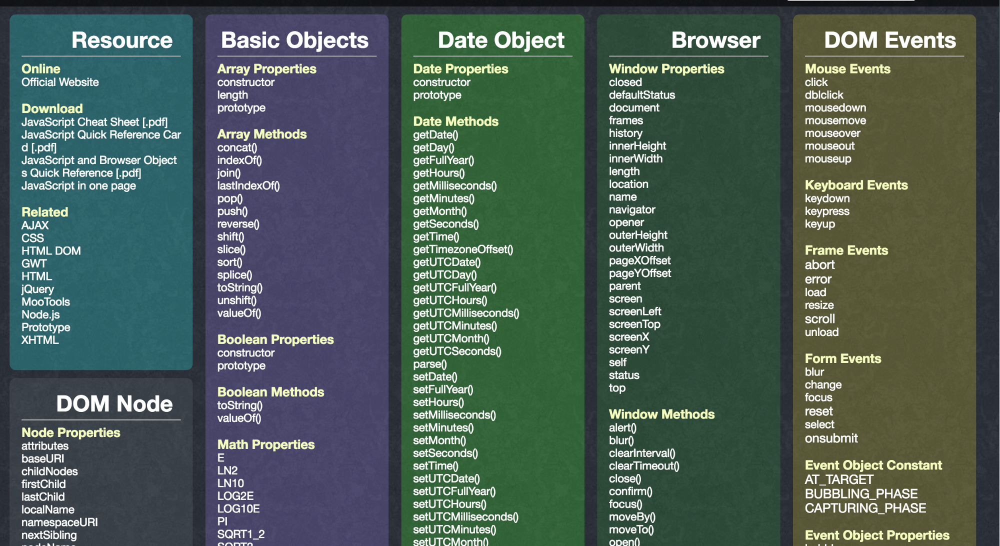

[Javascript 正则表达式](https://www.debuggex.com/cheatsheet/regex/javascript)

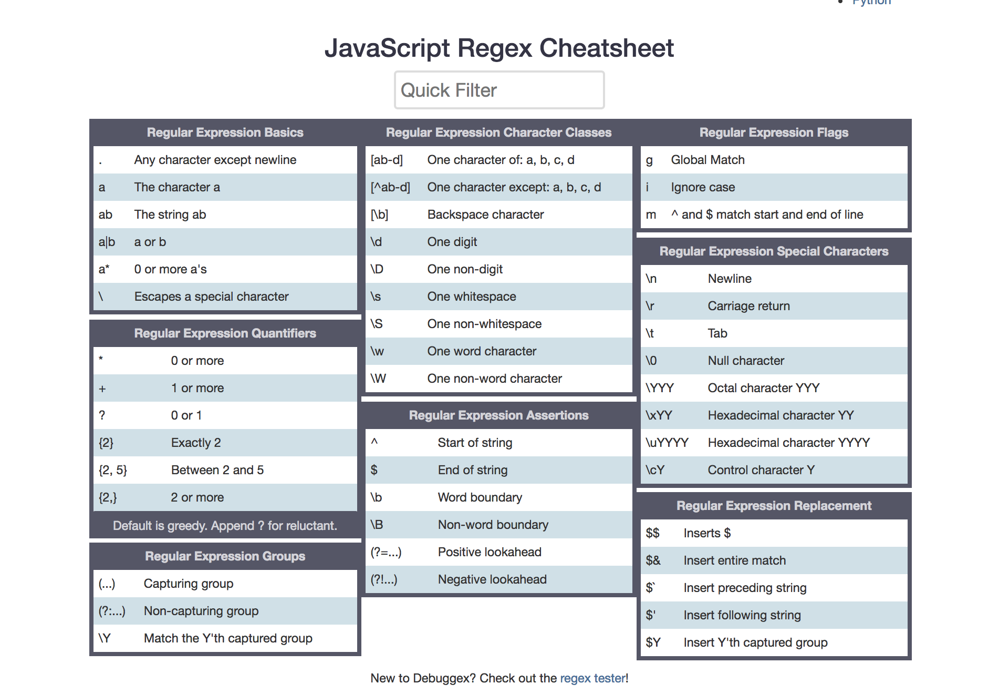

[Flexbox](https://yoksel.github.io/flex-cheatsheet/)

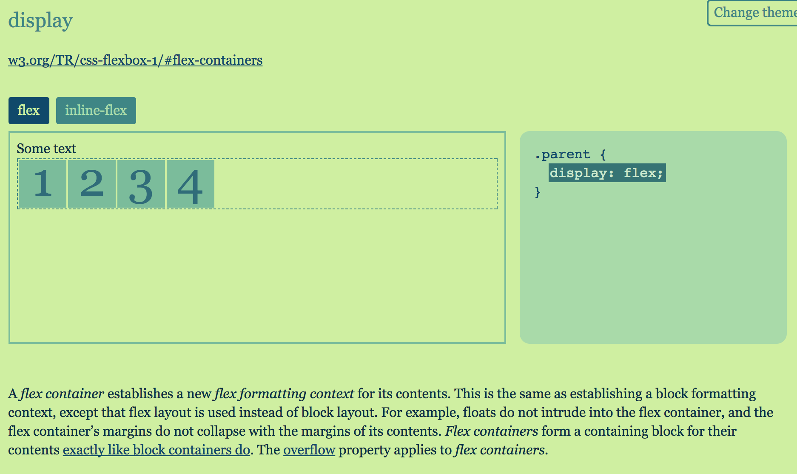

[Vuejs](https://vuejs-tips.github.io/cheatsheet/)

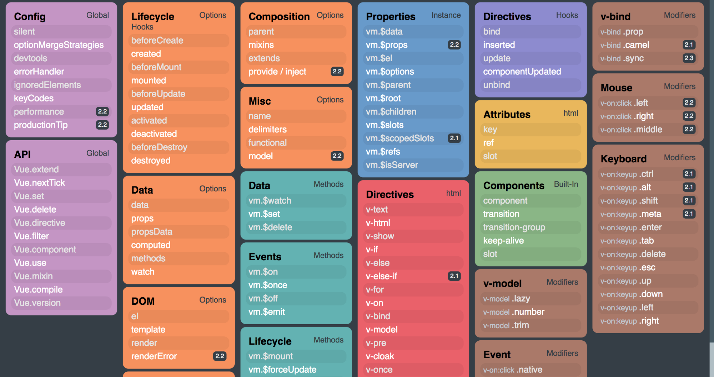

[Vuex](https://vuejs-tips.github.io/vuex-cheatsheet/)

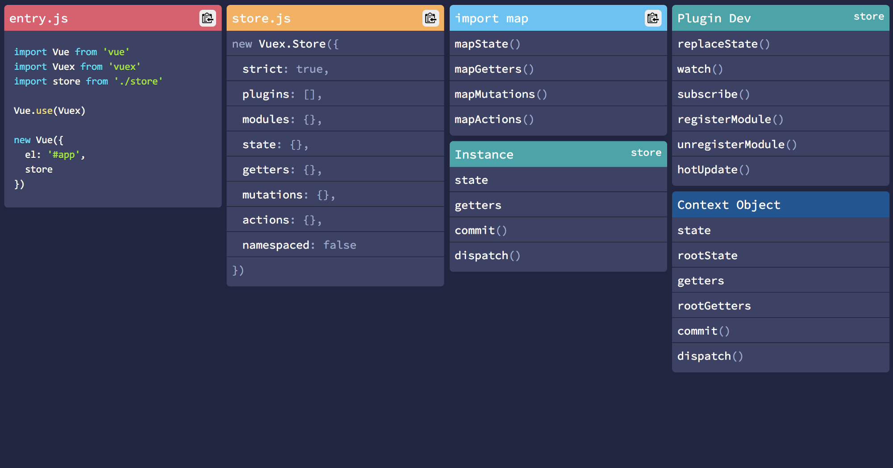

[Angular 4](https://angular.io/guide/cheatsheet)

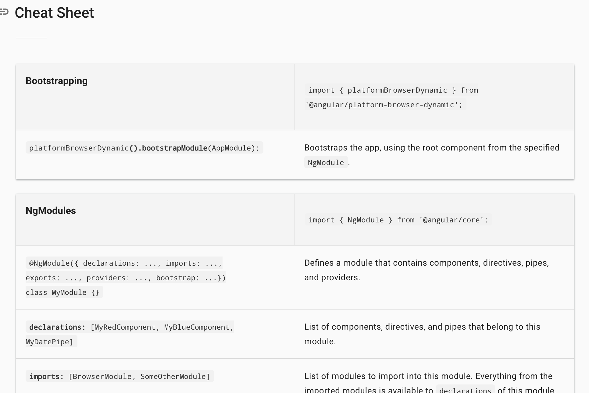

[React](https://www.html.cn/dev/react.html)

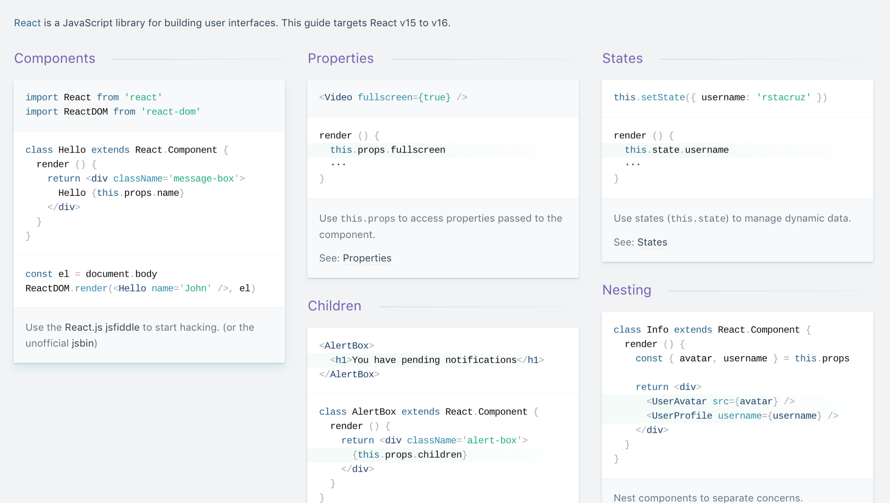

[Redux:downloaf pdf](https://github.com/linkmesrl/react-journey-2016/blob/master/resources/egghead-redux-cheat-sheet-3-2-1.pdf)

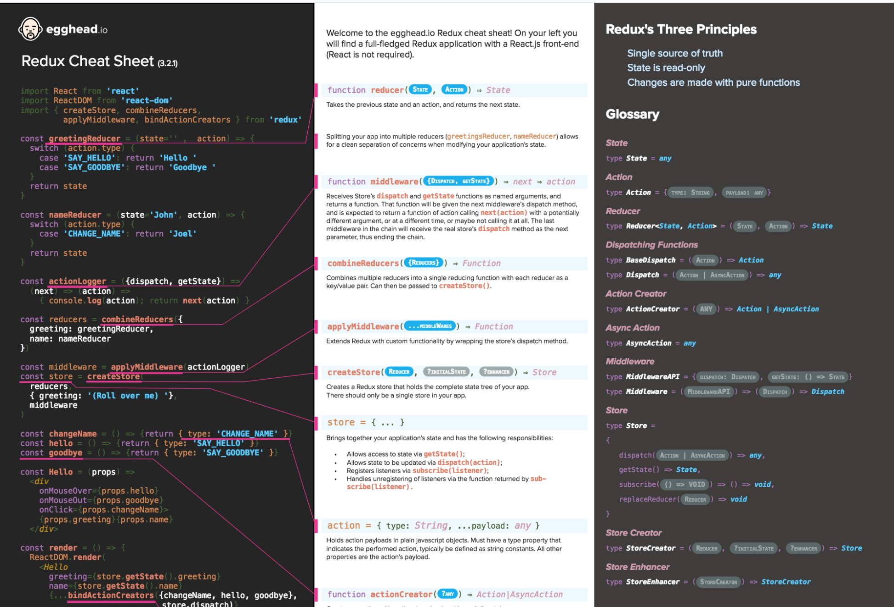

[SASS](https://www.html.cn/dev/sass.html)

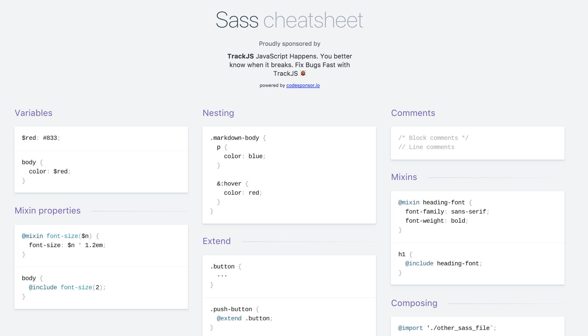

[Stylus](https://www.html.cn/dev/stylus.html)

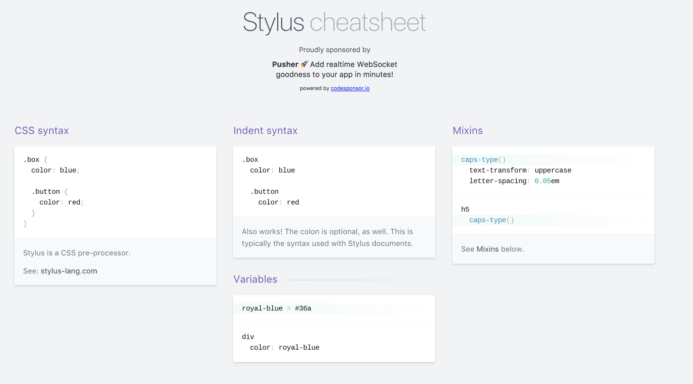

[GraphQL](https://raw.githubusercontent.com/sogko/graphql-shorthand-notation-cheat-sheet/master/graphql-shorthand-notation-cheat-sheet.png)

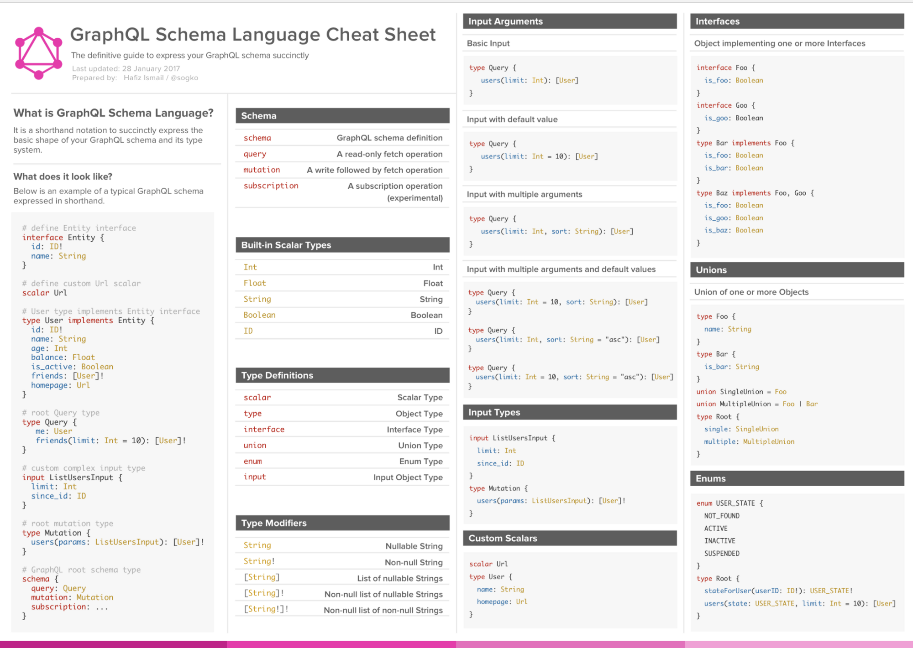

[jQuery](https://www.html.cn/jqapi-1.9/)

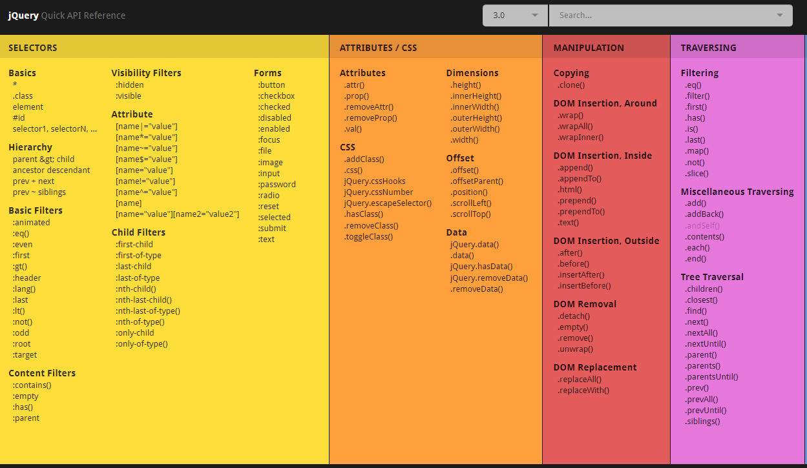

[CSS3](https://makeawebsitehub.com/css3-mega-cheat-sheet/)

[HTML5](https://makeawebsitehub.com/the-html-5-mega-cheat-sheet/)

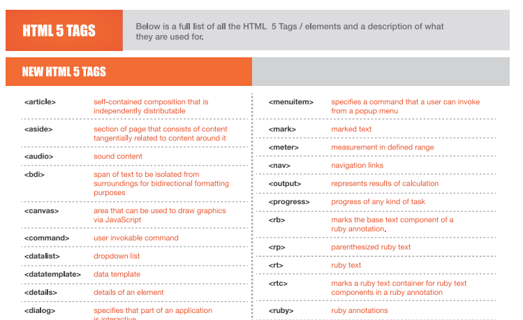

## 后端速查表

[Java 8](http://www.java8.org/)

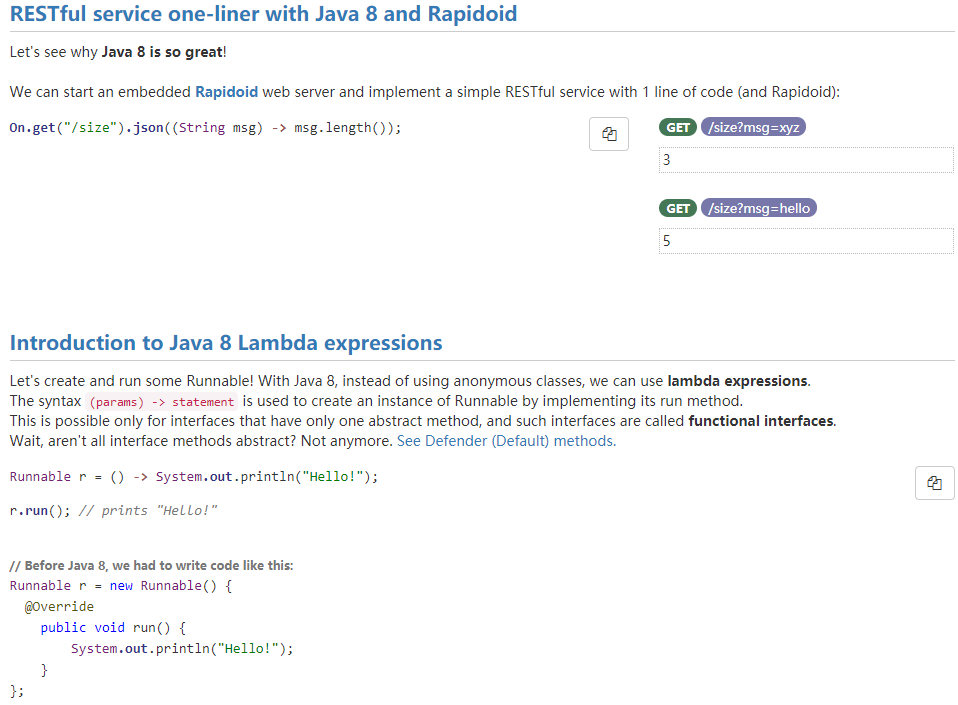

## 数据库

[mysql](https://ngapps.cn/database/#!cheatsheet/mysql.md)

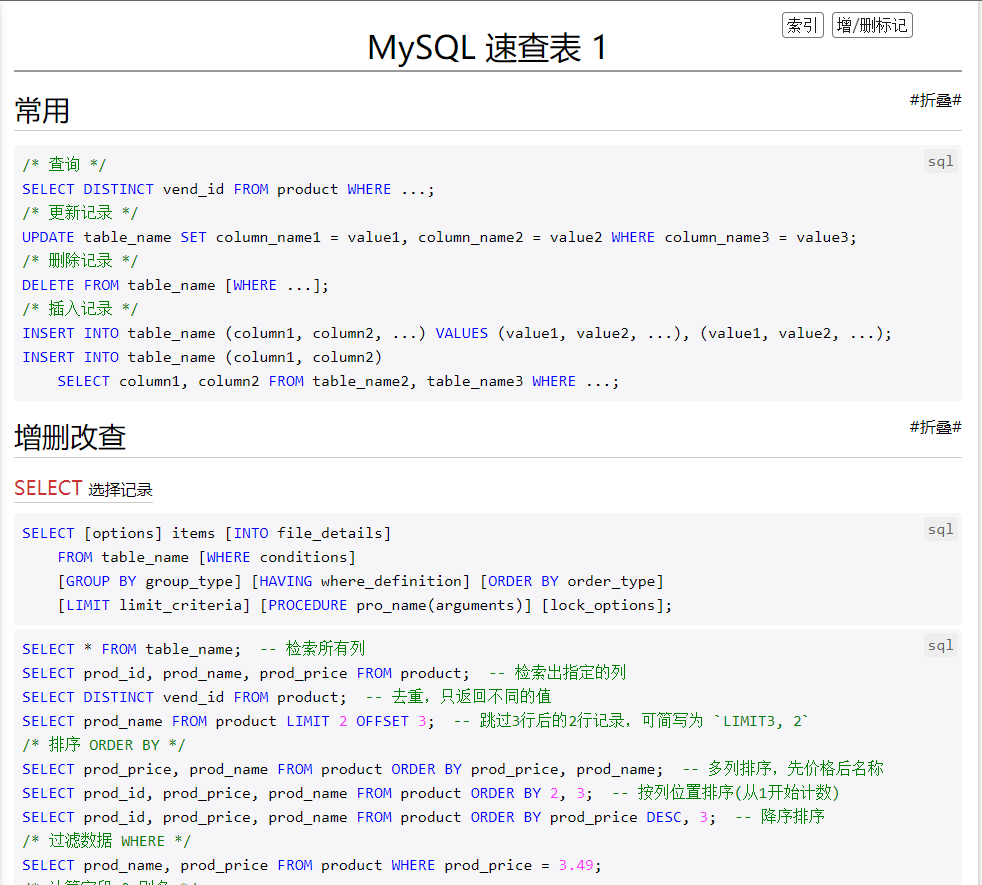

