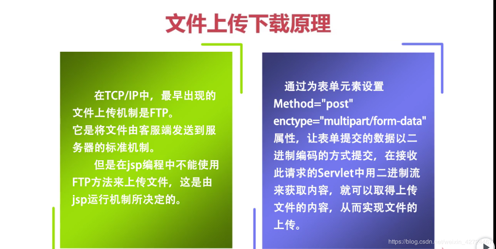

# 深入理解文件上传/下载

上传下载原理

表单enctype属性

* application/x-www-form-urlencoded: 默认编码方式,只处理表单域中的value属性值,采用这种编码方式的表单会将表单域中的值处理成URL编码方式。
* multipart/form-data: 这种编码方式的表单会以二进制流的方式来处理表单数据,这种编码方式会把文件域指定文件的内容也封装到请求参数里
* text/plain: 这种方式主要适用于表单发送邮件的方式

文件下载原理

* step1: 通过HttpServletResponse.setContentType方法设置Content-Type头字段的值,为浏览器无法使用某种方式或激活某个程序来处理的MIME类型,例如："application/ocet-strem" 或 "application/x-msdownload"等
* step2: 需要通过HttpServletResponse.setHeader方法设置Content-Disposition头的值为"attachment;filename = 文件名"
* step3: 读取下载文件,调用HttpServletResponse.getOutputStream方法返回ServletOutputStream对象来向客户端写入附件文件内容

文件上传后台实现步骤

* step1: 获取request当中的流信息,保存到临时文件
* step2: 从临时文件中得到上传到文件名,以及文件内容起止位置
* step3: 根据文件起始位置,读取上传文件内容,保存到本地

