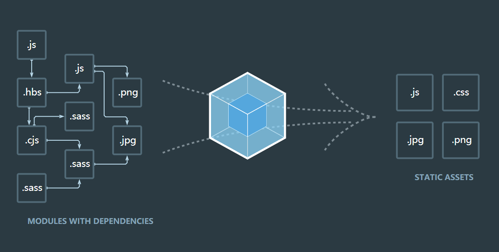

# webpack详解

> 本文章使用的是webpack4.0版本,低于4.0版本有所区别,为了熟悉yarn使用,就没有用npm下载包

## 了解webpack

### 什么是webpack

> webpack是一种模块化打包工具,分析项目结构,找到js模块以及其他的一些浏览器不能直接运行的拓展语言(scss,less,typescript等),并将其打包成合适的格式以供浏览器使用



### 可以实现的功能

> 代码转换(es6+转es5/scss,less转css等),文件优化(压缩文件),代码分隔(公共模块抽离等),模块合并,自动刷新,代码校验,自动发布

## 使用webpack

### 安装webpack以及webpack-cli

```bash
$ yarn add webpack webpack-cli -D
```

### 使用npx快速打包文件

```bash
$ npx webpack	// 会自动生成dist文件夹并打包到这个文件夹
```

### webpack.config.js

> development打包文件不会压缩,production打包文件会进行压缩

```js
let path = require('path')
module.exports = {
    mode: 'development',        // production  生产环境 / development  开发环境
    entry: './src/main.js',     // 入口文件
    output: {
        filename: 'bundle.js',  // 打包输出文件
        path: path.resolve(__dirname, 'dist')  // 在当前目录产生dist目录 
    }
}
```

### 定义脚本

```json
"scripts": {
    // "build": "webpack --config webpack.config.js"
	"build": "webpack"
}
```

```bash
$ npm run build -- --config webpack.config.js	// 如果需要脚本传参,需要额外--
```

### dev-server

> 可以配置开发服务器的主机,端口等,详细配置参考文章提供的webpack相关资料

```bash
$ yarn add webpack-dev-server -D	// 属于开发依赖
$ npx webpack-dev-server
```

### babel promise等更高级语法问题

```bash
@babel/plugin-transform-runtime
```


---

[webpack官网](https://www.webpackjs.com/)

[webpack常用loader](https://www.cnblogs.com/jiahuasir/p/10605201.html)

[dev-server快速开发应用](https://www.webpackjs.com/configuration/dev-server/)

[webpack插件列表](https://www.webpackjs.com/plugins/)

[html-minifer配置](https://github.com/kangax/html-minifier#options-quick-reference)

